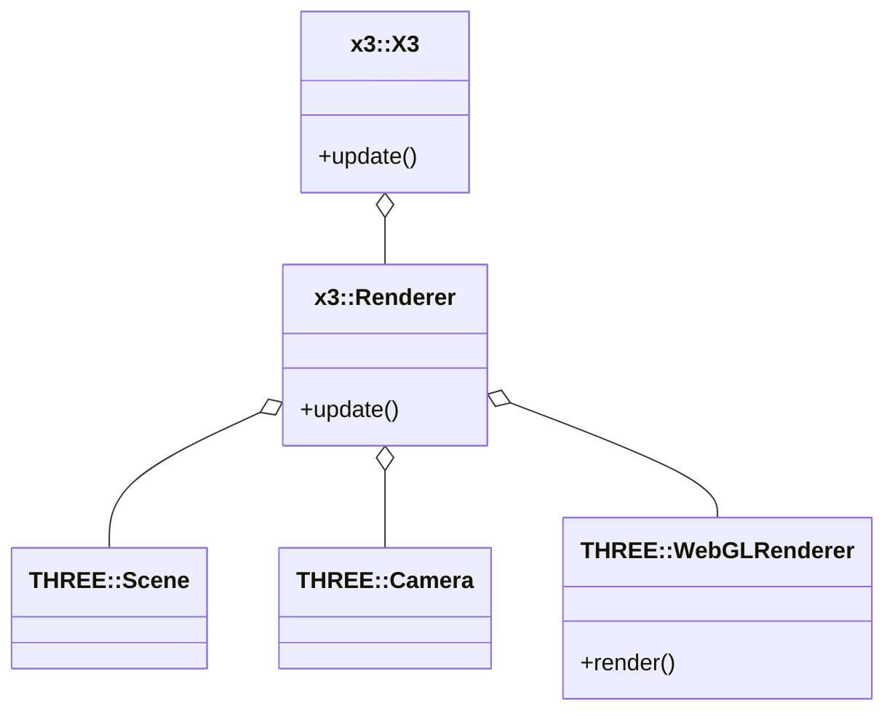

# X3

X3 is a toy project to use [Three.js](https://threejs.org/) from [Typescript](https://www.typescriptlang.org/).

## Getting started

Install the packages

```shell
yarn install
```

Start the server

```shell
yarn run build
yarn run start
```

Open your browser on <http://localhost:8080/basics.html>.

## Architecture


